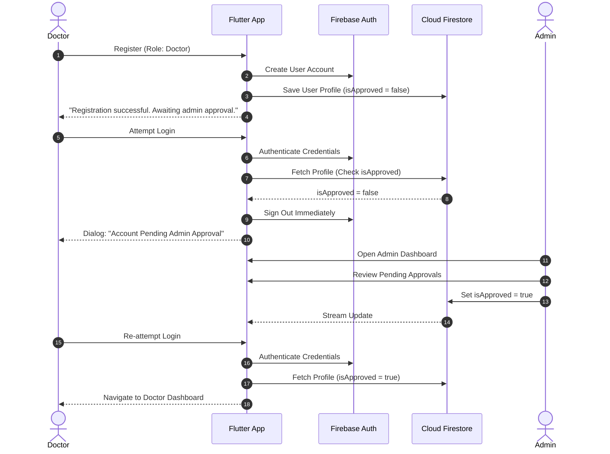

# 🏥 OPD Connect — Government Hospital Booking & Queue Tracker

[](https://flutter.dev)
[](https://firebase.google.com)
[](https://dart.dev)
[](https://flutter.dev)
[](https://www.figma.com/design/Uuu84aeXApggGVkASJ4D4x/OPD-Connect-UI?node-id=134-3068)

> **OPD Connect** is a mobile healthcare solution developed for government hospitals in Sri Lanka. It eliminates early-morning physical queues by enabling remote Outpatient Department (OPD) slot reservations, real-time live queue tracking, automated departure alerts, and administrative management.

---

## 📌 Table of Contents

- [Features by User Role](#-features-by-user-role)
- [Design & UI System](#-design--ui-system)
- [Architecture & Tech Stack](#-architecture--tech-stack)
- [Project Directory Structure](#-project-directory-structure)
- [Getting Started](#-getting-started)
- [Environment Configuration (.env)](#-environment-configuration-env)
- [Authentication & Approval Workflow](#-authentication--approval-workflow)
- [Security & Best Practices](#-security--best-practices)
- [Changelog & Roadmap](#-changelog--roadmap)
- [Authors & Acknowledgments](#-authors--acknowledgments)

---

## 🚀 Features by User Role

### 👤 Patient
* **Remote Slot Booking**: Reserve morning/evening OPD slots from home for selected hospitals and departments.
* **Live Queue Tracker**: Real-time position tracking in the doctor's queue.
* **Smart Departure Alerts**: Notifies patients when to leave home based on estimated waiting times.
* **Medical Profile**: View past appointments and consultation histories.

### 🩺 Doctor
* **Queue Management**: View list of waiting patients, call next token, and mark consultations complete.
* **Consultation Notes**: Record diagnoses and digital prescriptions.
* **Admin Verification Gate**: Newly registered doctors require approval by a hospital administrator before accessing doctor features.

### 🛡️ Administrator
* **Executive Dashboard**: Real-time overview of total registered users, patients, doctors, and pending doctor registrations.
* **Doctor Approvals**: Review doctor credentials, approve, or reject registrations.
* **User Management (CRUD)**: Search, view detailed profile information, edit user details, and delete accounts.
* **Role-Based Access Control**: Enforces security policies across Firestore and UI routing.

---

## 🎨 Design & UI System

The application UI is designed based on the **[OPD Connect Figma Design](https://www.figma.com/design/Uuu84aeXApggGVkASJ4D4x/OPD-Connect-UI?node-id=134-3068)**.

### Color Palette

| Token | Hex Code | Usage |
|---|---|---|
| **Primary Brand** | `#1E40AF` / `#2563EB` | App bars, primary action buttons, branding |
| **Dark Surface** | `#0F172A` | Admin header, typography headers |
| **Medical Teal** | `#0D9488` / `#059669` | Patients, success states, confirmed slots |
| **Specialist Violet** | `#7C3AED` / `#6D28D9` | Doctors, specialization badges |
| **Alert Amber** | `#F59E0B` / `#D97706` | Pending approvals, queue warnings |
| **Background** | `#F8FAFC` | Screen backgrounds, cards, list surfaces |

---

## 🛠️ Architecture & Tech Stack

* **Frontend Framework**: Flutter (Dart)
* **Authentication**: Firebase Authentication (Email/Password)
* **Database**: Google Cloud Firestore (Real-time streams & collections)
* **Environment Management**: `flutter_dotenv`
* **Design Standards**: Material 3 Design Guidelines

---

## 📁 Project Directory Structure

```text
opd_connect/
├── assets/
│   └── images/                     # Splash & onboarding illustrations
├── lib/
│   ├── main.dart                   # Application entry point & dotenv loader
│   ├── firebase_options.dart       # Firebase platform configuration
│   ├── models/
│   │   └── user_model.dart         # User data model & role definitions
│   ├── services/
│   │   ├── auth_service.dart       # Authentication & profile management
│   │   ├── admin_service.dart      # Admin statistics & approval actions
│   │   └── seed_service.dart       # Automatic admin account initialization
│   ├── widgets/
│   │   └── auth_wrapper.dart       # Role-based route guard & redirector
│   └── screens/
│       ├── auth/
│       │   ├── splash_screen.dart   # Onboarding carousel
│       │   ├── login_screen.dart    # Login with role verification
│       │   └── register_screen.dart # Multi-role registration (Patient / Doctor)
│       └── admin/
│           ├── admin_dashboard_screen.dart       # Main admin overview & stats
│           ├── admin_user_list_screen.dart       # Patient & Doctor lists (CRUD)
│           ├── admin_user_detail_screen.dart     # User profile view/edit
│           └── admin_pending_doctors_screen.dart # Doctor approval queue
├── .env.example                    # Sample environment variable template
├── .gitignore                      # Git ignore file (excludes secrets & .env)
├── pubspec.yaml                    # Dependencies & asset manifests
└── README.md                       # Project documentation
```

---

## ⚡ Getting Started

### Prerequisites
* [Flutter SDK](https://docs.flutter.dev/get-started/install) (`^3.13.0` or higher)
* [Dart SDK](https://dart.dev/get-dart) (`^3.0.0` or higher)
* [Android Studio](https://developer.android.com/studio) / [VS Code](https://code.visualstudio.com/) with Flutter plugins
* A configured [Firebase Project](https://console.firebase.google.com/)

### Installation Steps

1. **Clone the Repository**:
   ```bash
   git clone https://github.com/Malinda-Rathnayaka/OPD-Connect.git
   cd OPD-Connect/opd_connect
   ```

2. **Install Dependencies**:
   ```bash
   flutter pub get
   ```

3. **Configure Environment Variables**:
   Copy `.env.example` to `.env` in the root directory:
   ```bash
   cp .env.example .env
   ```
   Edit `.env` and configure your initial admin credentials:
   ```env
   ADMIN_EMAIL=admin@opdconnect.lk
   ADMIN_PASSWORD=YourSecurePassword123!
   ```

4. **Run the Application**:
   ```bash
   flutter run
   ```

---

## ⚙️ Environment Configuration (.env)

The application uses `flutter_dotenv` to manage sensitive seed credentials securely without hardcoding them into source control.

| Variable Name | Description | Default Example |
|---|---|---|
| `ADMIN_EMAIL` | Email address for initial auto-seeded Admin account | `admin@opdconnect.lk` |
| `ADMIN_PASSWORD` | Password for initial auto-seeded Admin account | `AdminPassword123!` |

> ⚠️ **Note**: Never commit your active `.env` file to Git. `.env` is listed in `.gitignore`.

---

## 🔒 Authentication & Approval Workflow



---

## 🛡️ Security & Best Practices

- **Role Guarding**: `AuthWrapper` continuously validates authentication state and redirects users to role-specific screens (Admin, Doctor, Patient).
- **Environment Isolation**: Sensitive configuration and seed passwords remain in local `.env` files.
- **Data Integrity**: Admin operations (update, delete, approve) are handled through atomic Firestore updates with validation.

---

## 📝 Changelog & Roadmap

### v1.0.0 (Current Release)
- [x] Initial UI Onboarding & Splash Screens with carousel
- [x] Firebase Authentication (Email/Password)
- [x] Multi-role User Registration (Patient & Doctor)
- [x] Admin Approval Workflow for Doctors
- [x] Admin Dashboard with Real-time Metrics & User Management (CRUD)
- [x] Responsive layout with zero overflow on all screen sizes
- [x] Figma design system color alignment

### Upcoming Features
- [ ] Patient OPD slot booking system with hospital & department filters
- [ ] Real-time queue token generation and live display
- [ ] SMS / Push notification service for smart departure alerts
- [ ] Prescription & lab report attachment uploads

---

## 👥 Authors & Acknowledgments

* **Malinda Rathnayaka** — *Lead Developer / HCI Project*
* **SLIIT** — *Faculty of Computing (IT3060 - Human Computer Interaction)*
* **Design Reference**: [OPD Connect UI on Figma](https://www.figma.com/design/Uuu84aeXApggGVkASJ4D4x/OPD-Connect-UI?node-id=134-3068)
